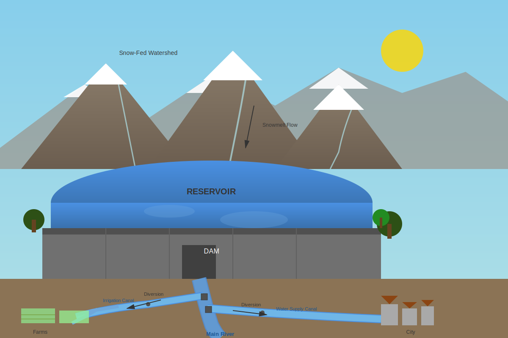

# ResLLM
ResLLM is a Python-based library for simulating water system management with large language models (LLMs).


*An LLM-generated SVG diagram translating a text prompt about water infrastructure into a complete visual system from mountain watershed to downstream distribution.*

## Overview
- LLM-driven water allocation decisions
- Physics-based reservoir simulation with flood control and conservation constraints
- Probabilistic inflow forecasting integration
- Detailed logging of decisions, justifications, and concept importance rankings

## Installation

```bash
# Clone the repository
git clone https://github.com/wyattarnold/ResLLM.git
cd ResLLM

# Install dependencies
pip install -r requirements.txt

# Set up environment variables for API keys
cp .env.example .env
# Edit .env and add your API keys:
# OPENAI_API_KEY=your_key_here
# GOOGLE_API_KEY=your_key_here
# XAI_API_KEY=your_key_here
```

## Quick Start

Run a historical simulation using OpenAI's o4-mini model:

```bash
cd resllm
python simulate.py \
  --model-server OpenAI \
  --model o4-mini-2025-04-16 \
  --config folsom_hist.yml \
  --start-year 1996 \
  --end-year 2016 \
  --starting-storage 466.1
```

This simulates reservoir operations from 1996-2016 using historical inflow data from California's Folsom Reservoir.

## Usage

### Basic Command Structure

```bash
python simulate.py \
  --model-server <SERVER> \
  --model <MODEL_NAME> \
  --config <CONFIG_FILE> \
  --start-year <YYYY> \
  --end-year <YYYY> \
  --starting-storage <TAF>
```

### Required Arguments

| Argument | Description | Example |
|----------|-------------|---------|
| `--config` | Configuration YAML file (in `configs/`) | `folsom_hist.yml` |
| `--start-year` | First water year to simulate | `1996` |
| `--end-year` | Last water year to simulate | `2016` |
| `--starting-storage` | Initial reservoir storage (TAF) | `466.1` |
| `--model-server` | LLM provider | `OpenAI`, `Ollama`, `Google`, `xAI` |
| `--model` | Model identifier | `o4-mini-2025-04-16`, `gpt-oss:120b` |

### Optional Arguments

| Argument | Default | Description |
|----------|---------|-------------|
| `--nsample` | `1` | Number of simulation replications |
| `--temperature` | `0.1` | Sampling temperature for LLM |
| `--fix-tocs` | `False` | Use fixed TOCS instead of adaptive |
| `--include-double-check` | `False` | Enable decision verification step |
| `--include-num-history` | `0` | Number of past decisions to include in context |
| `--include-red-herring` | `True` | Include irrelevant information test |

### Example Commands

**Historical scenario with forecast data:**
```bash
python simulate.py \
  --model-server OpenAI \
  --model o4-mini-2025-04-16 \
  --config folsom_hist_forecast.yml \
  --start-year 1996 \
  --end-year 2016 \
  --starting-storage 466.1
```

**Multiple samples:**
```bash
python simulate.py \
  --model-server OpenAI \
  --model o4-mini-2025-04-16 \
  --config folsom_hist_forecast.yml \
  --start-year 1996 \
  --end-year 2016 \
  --starting-storage 466.1 \
  --nsample 20
```

**Local model using Ollama:**
```bash
python simulate.py \
  --model-server Ollama \
  --model gpt-oss:120b \
  --config folsom_hist.yml \
  --start-year 1996 \
  --end-year 2016 \
  --starting-storage 466.1 \
  --temperature 0.1
```

## Configuration Files

Configuration files define reservoir characteristics, data sources, and operational constraints. They are stored in `resllm/configs/` and use YAML format.

### Example Configuration

```yaml
config_name: "folsom_hist"

folsom_reservoir:
  operable_storage_max: 975  # TAF
  operable_storage_min: 90   # TAF
  max_safe_release: 130000   # cfs
  
  # Storage-elevation relationship (TAF to ft)
  sp_to_ep: [[0, 48, 93, ...], [210, 305, 332, ...]]
  
  # Day of water year to TOCS (TAF)
  tp_to_tocs: [[0, 50, 151, ...], [975, 400, 400, ...]]
  
  # Storage to max release (TAF to cfs)
  sp_to_rp: [[90, 100, 400, ...], [0, 35000, 40000, ...]]
```

## Output Files

Simulations produce two CSV files per sample in `resllm/output/<experiment_name>/`:

### 1. Simulation Output
`<model>_simulation_output_n<sample>.csv`

Daily time series with columns:
- `date`, `wy`, `mowy`, `dowy` - Temporal identifiers
- `qt` - Inflow (TAF)
- `st` - Storage (TAF)
- `rt` - Release (TAF)
- `dt` - Downstream demand (TAF)
- `uu` - Target release based on allocation (TAF)

### 2. Decision Output
`<model>_decision_output_n<sample>.csv`

Monthly allocation decisions with columns:
- `date`, `wy`, `mowy`, `dowy` - When decision was made
- `qwyaccum` - Cumulative water year inflow (TAF)
- `d_wy_rem` - Remaining water year demand (TAF)
- `st_1` - Current storage (TAF)
- `observation` - Full prompt sent to LLM
- `allocation_percent` - Decision (0-100%)
- `allocation_justification` - LLM's reasoning
- Concept importance rankings (e.g., `current_storage`, `goal`, etc.)

## Architecture

### Core Components

**`src/reservoir.py`**
- `Reservoir` class: Physics-based reservoir model
- Handles mass balance: storage = previous storage + inflow - release
- Implements flood control rules (TOCS constraints)
- Computes safety releases based on storage-elevation curves

**`src/operator.py`**
- `ReservoirAllocationOperator` class: LLM agent wrapper
- Constructs decision prompts with operational context
- Manages multi-turn conversations with history
- Parses structured decisions using Pydantic models
- Supports multiple LLM providers via agno framework

**`src/utils.py`**
- Unit conversions (CFS ↔ TAF)
- Water year date calculations
- Decision post-processing utilities

**`simulate.py`**
- Main simulation orchestrator
- Daily time-stepping loop
- Monthly decision points
- Output file management

### Decision-Making Process

Each month, the LLM operator receives:

1. **Current State**
   - Storage level (TAF)
   - Cumulative inflow to date
   - Remaining demand for the water year

2. **Historical Context**
   - Previous allocation decisions
   - Past observations

3. **Forecasts** (if available)
   - Probabilistic inflow projections
   - Mean, 10th, and 90th percentile scenarios

4. **Operational Constraints**
   - Max/min storage levels
   - Average seasonal demand patterns
   - Average seasonal inflow patterns

The LLM responds with:
- Allocation percentage (0-100%)
- Justification for the decision
- Importance ranking of decision factors

## Supported LLM Providers

### OpenAI
```bash
export OPENAI_API_KEY=your_key
python simulate.py --model-server OpenAI --model o4-mini-2025-04-16 ...
```

### Ollama (Local)
```bash
# Start Ollama server, then:
python simulate.py --model-server Ollama --model gpt-oss:120b --temperature 0.1 ...
```

### Google Gemini
```bash
export GOOGLE_API_KEY=your_key
python simulate.py --model-server Google --model gemini-2.5-pro ...
```

### xAI
```bash
export XAI_API_KEY=your_key
python simulate.py --model-server xAI --model grok-2 --temperature 0.1 ...
```

## Data Requirements

### Input Data Format

**Inflow file** (`folsom_daily.csv`):
```csv
date,inflow
1996-10-01,0.5
1996-10-02,0.6
...
```

**Demand file** (`demand.txt`):
```
2.5
2.5
2.6
...
```
(365 daily values in TAF)

**Forecast file** (optional, `FOLC1_wy_hindcast.csv`):
```csv
date,QCYFHM,QCYFH1,QCYFH9
1996-01-01,500,300,700
...
```
- `QCYFHM`: Mean forecast
- `QCYFH1`: 10th percentile
- `QCYFH9`: 90th percentile

